# Installing AstroOS

A step by step guide to putting AstroOS on a computer, written for the closed
beta. It takes about twenty minutes plus the download. If anything here does
not match what you see on screen, that is a bug worth reporting (see
[When something goes wrong](#when-something-goes-wrong)).

AstroOS is a research and astronomy workstation built on Arch Linux, with KDE
Plasma, a signed package repository of its own, and the scientific and security
toolchains preinstalled. It is the same system whether you run it from the USB
stick to try it or install it to disk.

## What you need

- A 64 bit PC with **UEFI** firmware (anything from the last decade).
- A **USB stick of 16 GB or more**. Flashing erases everything on it.
- About **30 GB of free disk space** on the target machine, and 4 GB of RAM or more.
- A **wired or wireless network connection** during install. The installer
  downloads the system from the AstroOS and Arch repositories, so it needs to
  be online.
- Ten minutes to download an 8 GB image.

A virtual machine works too. Give it UEFI firmware (in VirtualBox tick
*Enable EFI*; in virt-manager pick the OVMF/UEFI firmware), 4 CPUs, 8 GB of
RAM and a 40 GB disk, and it installs exactly as a real machine does. Every
screenshot in this guide was taken in a VM.

## 1. Download the image

The newest release always lives at the same place. First read the one line
that names it:

```
https://astroosrepo.blob.core.windows.net/iso/LATEST
```

Open that URL in a browser (or `curl` it). It prints a single directory name,
something like `astroos-desktop-linux-260906-a6ed9ee`. Everything for that
release sits under:

```
https://astroosrepo.blob.core.windows.net/iso/<that-name>/
```

Download these three files from that directory into one folder:

| File | What it is |
|------|------------|
| `astroos-desktop-linux-<date>.iso` | the image you flash and boot |
| `...iso.sha256` | the checksum, to prove the download is intact |
| `...iso.asc` | the signature, to prove the image is genuinely ours |

The same directory also holds `RELEASE`, `build-metadata.txt`,
`manifest.pkglist` and `audit.txt` if you want to see exactly what went into
the build and which checks it passed. You do not need them to install.

## 2. Verify the download

This step is quick and it is worth doing. It confirms the 8 GB arrived intact
and that the image was signed by the AstroOS release key, not tampered with in
transit.

On Linux or macOS, in the folder where you saved the files:

```sh
# 1. checksum: this must print "OK"
sha256sum -c astroos-desktop-linux-*.iso.sha256

# 2. signature: import the AstroOS repository key, then check the .asc
curl -fsSLO https://astroosrepo.blob.core.windows.net/repo/astroos/astroos.gpg
gpg --import astroos.gpg
gpg --verify astroos-desktop-linux-*.iso.asc astroos-desktop-linux-*.iso
```

The key you imported must show this fingerprint, and the signature check must
say **Good signature**:

```
DA5C 947A 5C32 9E52 8948  8302 3923 0475 6ECC 2F9D 8
```

gpg will add a line saying the key is not certified with a trusted signature.
That is expected: it means only that you have not personally signed our key,
not that anything is wrong. What matters is *Good signature* and the
fingerprint above.

On Windows, verify the checksum in PowerShell:

```powershell
Get-FileHash .\astroos-desktop-linux-*.iso -Algorithm SHA256
```

and compare the printed hash against the contents of the `.iso.sha256` file
(open it in Notepad). To also check the signature, install Gpg4win and run the
same `gpg --verify` command shown above.

## 3. Flash it to the USB stick

Flashing writes the image to the stick and **erases everything already on it**.
Pick whichever tool matches your computer.

**balenaEtcher** (Windows, macOS, Linux, the simplest) from
[balena.io/etcher](https://etcher.balena.io/): *Flash from file*, select the
`.iso`, select your USB stick, *Flash*.

**Rufus** (Windows) from [rufus.ie](https://rufus.ie/): select the device,
select the `.iso`, leave the partition scheme at **GPT / UEFI**, *Start*, and
when it asks choose **Write in DD Image mode**.

**Ventoy** (Windows, Linux) if you keep several ISOs on one stick: install
Ventoy on the stick once, then copy the `.iso` onto it. Boot the stick and pick
AstroOS from Ventoy's menu.

**dd** (Linux or macOS, for the confident) after checking the device name with
`lsblk` so you do not overwrite the wrong disk:

```sh
sudo dd if=astroos-desktop-linux-*.iso of=/dev/sdX bs=4M status=progress conv=fsync
```

## 4. Boot from the stick

1. Leave the stick in and restart the computer.
2. Open the firmware boot menu. It is a key pressed right after power on,
   usually **F12**, **F10**, **Esc** or **F2** depending on the maker. Choose
   the USB stick, listed with **UEFI** in front of its name.
3. **Turn Secure Boot off** first if the stick will not boot. It is in the
   firmware setup under Security or Boot. The Arch base AstroOS builds on does
   not ship a signed boot chain yet, so Secure Boot must be disabled.

You are greeted by the AstroOS boot menu. Press Enter on the first entry, or
just wait.

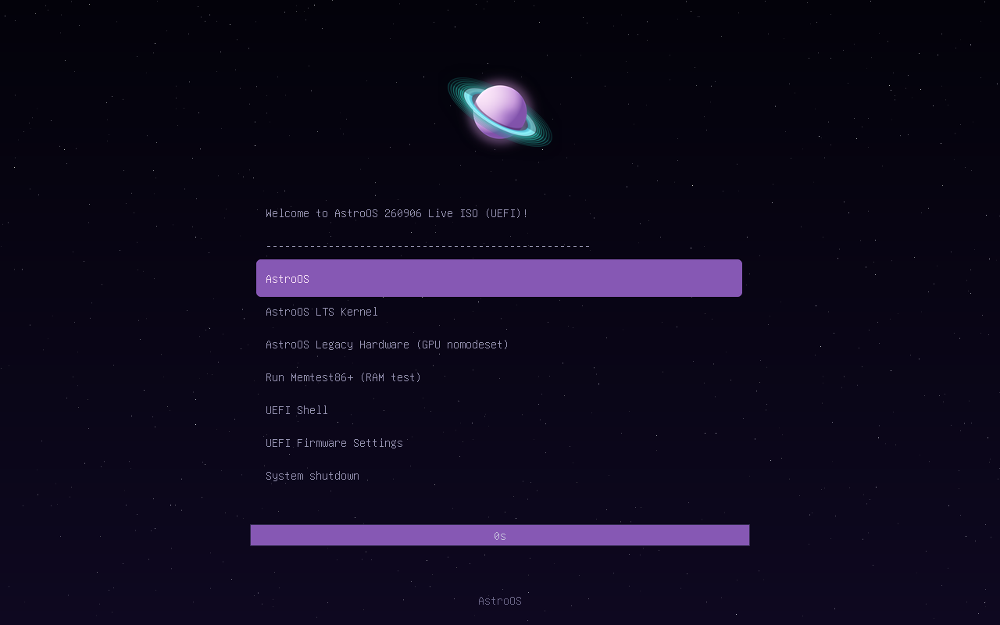

A short starfield splash with the AstroOS planet plays while the live system
loads.

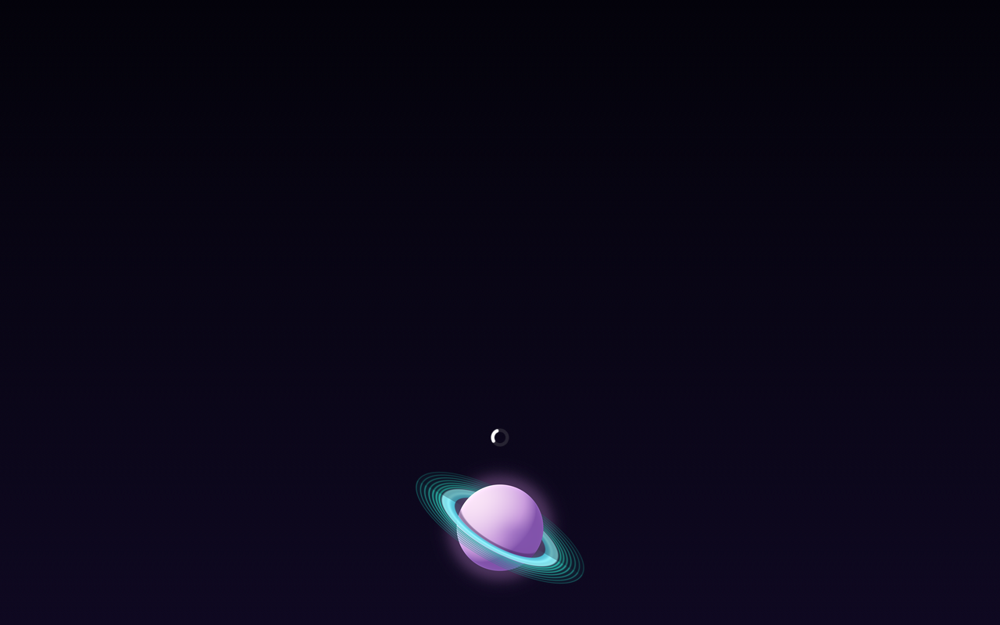

## 5. Try the live desktop

In under a minute you land on the live KDE Plasma desktop. Nothing is installed
yet: this is AstroOS running entirely from the stick, so you can click around,
open apps and check your hardware works before committing anything to disk.

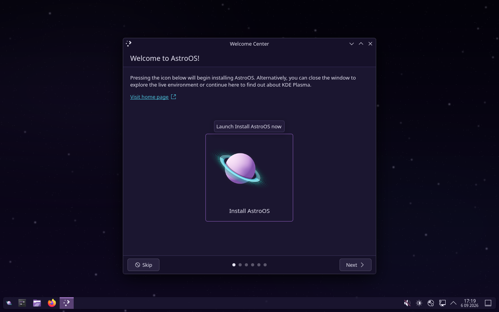

The **Welcome Center** opens on top. To install, click the **Install AstroOS**
icon in it. You can also close the Welcome Center, explore first, and start the
installer later from the application menu (bottom left) under **Install
AstroOS**.

Open a terminal (**Konsole**) any time to look around. It greets you with the
system summary.

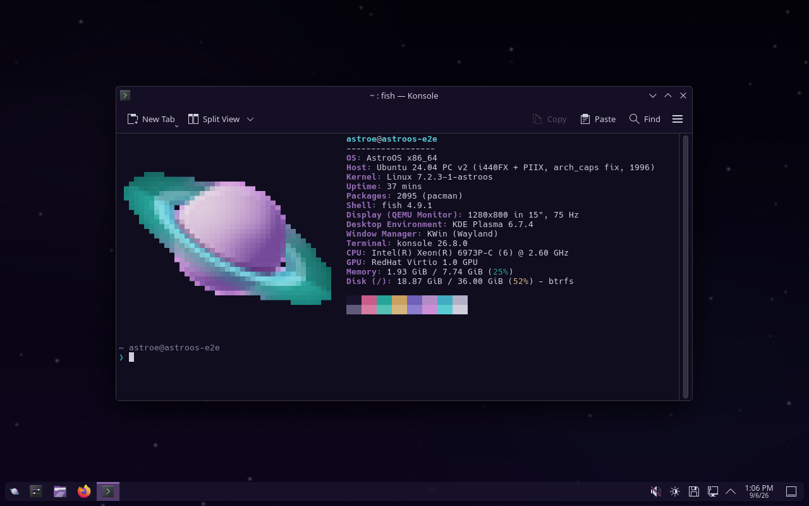

## 6. Run the installer

The installer walks through a row of pages along the bottom. Most pages are
already filled in sensibly; you can click **Next** straight through and only
stop where you have a real choice to make. It needs to be online, since it
downloads the system as it goes.

**Welcome.** Pick your language, then **Next**.

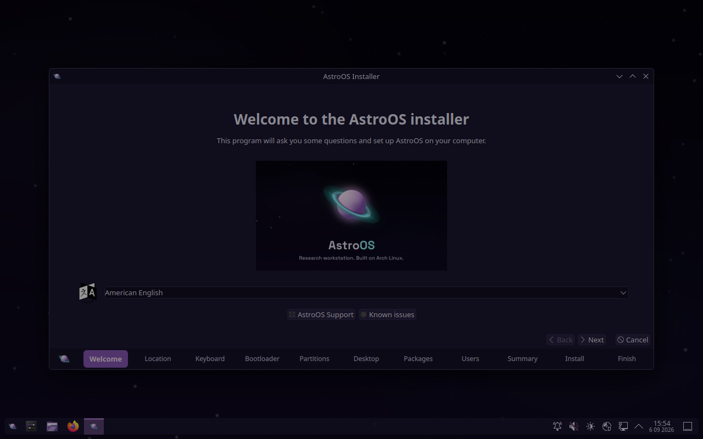

**Location** and **Keyboard** are detected from your language. Correct them if
needed, then **Next** through both.

**Bootloader.** The default is fine for most people. AstroOS offers GRUB,
rEFInd, systemd-boot and Limine; each preview is branded. Choose Limine or GRUB
if you want Btrfs snapshot boot entries.

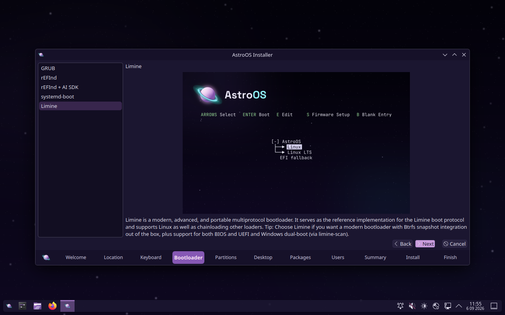

**Partitions.** The simplest choice is **Erase disk**, which wipes the selected
drive and sets AstroOS up on it with a Btrfs layout. Tick **Encrypt system** if
you want full disk encryption and choose a passphrase. If you are dual booting,
use **Manual partitioning** instead and point the installer at the partitions
you prepared.

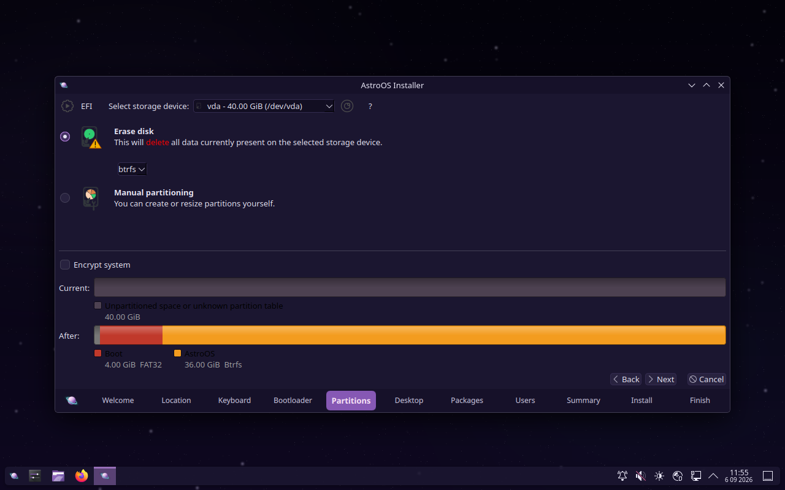

> Erase disk deletes everything on the drive you select. Make sure you picked
> the right one and that anything you care about is backed up.

**Desktop.** KDE **Plasma Desktop** is the AstroOS default and the one this
guide shows. Other desktops and window managers are offered if you prefer them.

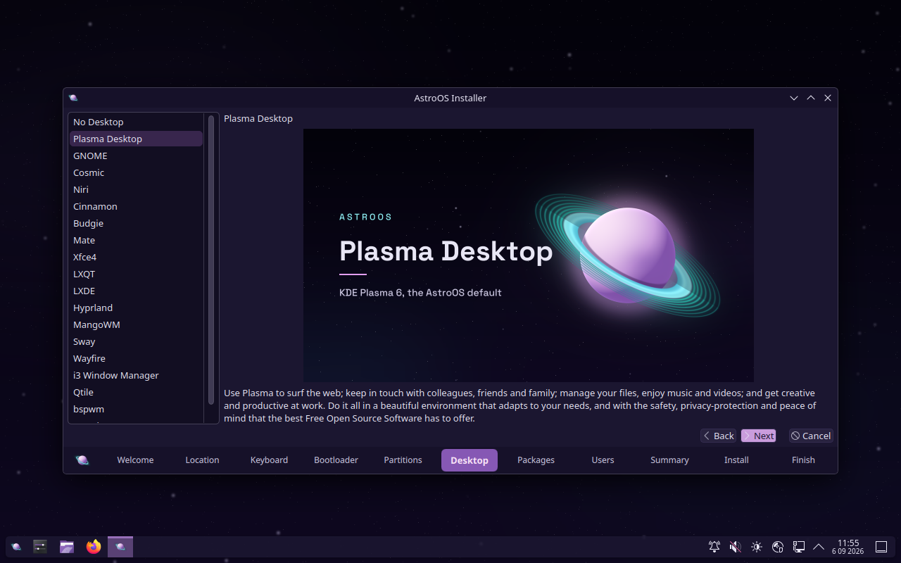

**Packages.** The scientific, security and continuity toolchains are
preselected. Leave them as they are for the full AstroOS, or untick groups you
do not want.

**Users.** Enter your name, the login name, the computer's name and a password.
Leave *Use the same password for the administrator account* ticked unless you
want a separate root password. Green ticks mean each field is valid.

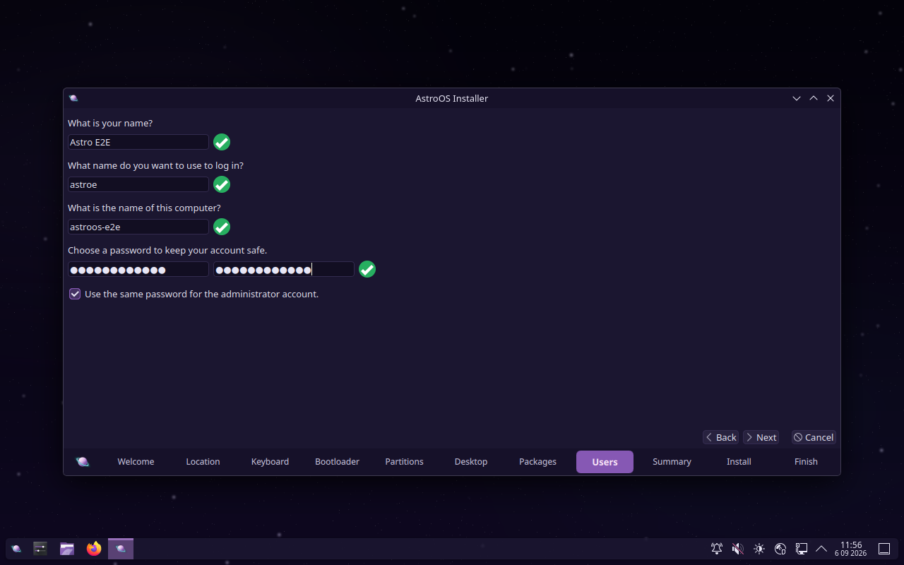

**Summary.** This is the last screen before anything is written. It lists every
change: timezone, keyboard, the partitions that will be created, the packages.
Read it, then click **Install**.

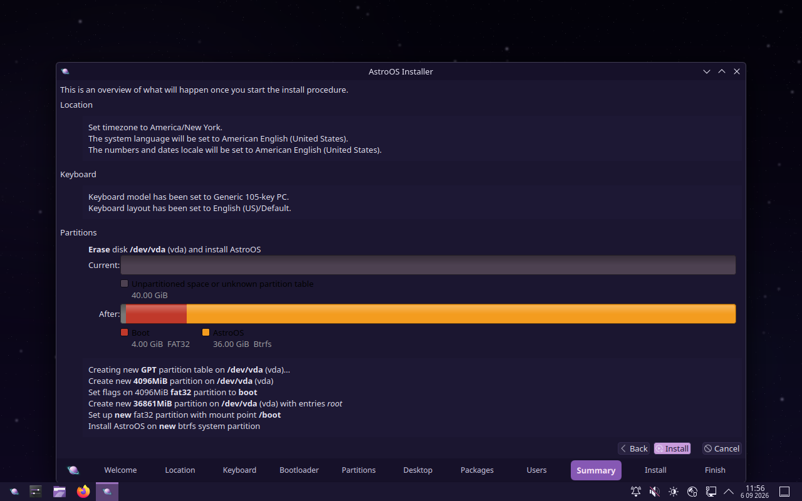

The installer now formats the disk, downloads and copies the system, and sets
up your user. It shows a progress bar and a slideshow while it works. This is
the slow part, usually ten to twenty minutes depending on your connection.

When it finishes it offers to restart. **Remove the USB stick** as the machine
reboots, so it boots from the disk you just installed to.

## 7. First boot

The installed system starts with the same starfield splash, then the AstroOS
login screen. Type the password you chose and press Enter.

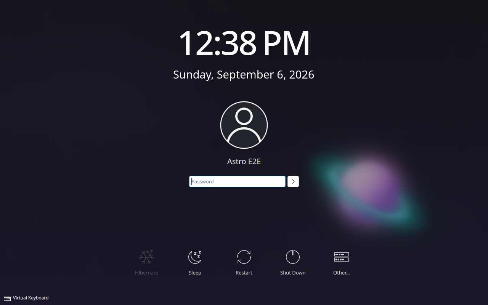

You arrive at your own AstroOS desktop, branded end to end, with your files,
your user and the full toolchain in place.

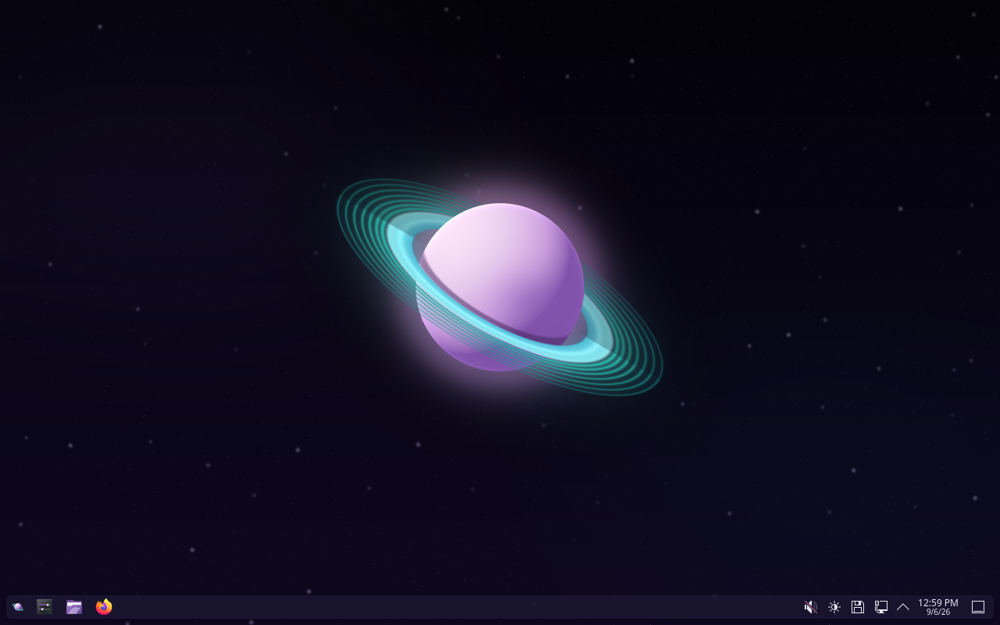

Everything is under the application menu at the bottom left: your apps grouped
by category, Firefox, Dolphin the file manager, Konsole the terminal, and
System Settings.

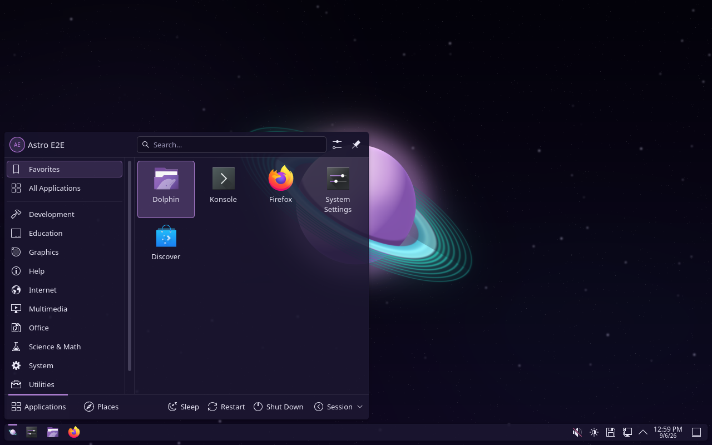

## 8. Keeping it up to date

Open Konsole and run:

```sh
sudo pacman -Syu
```

That updates Arch, the CachyOS performance packages and the signed `[astroos]`
repository together. A notifier tells you when a kernel or core update wants a
reboot.

A few things worth knowing on day one:

- **`astroos-doctor`** prints a health report. Paste it into any bug report.
- **`sudo astroos-hacking-heavy --install`** fetches the large security tools
  (Burp Suite, SecLists, Metasploit, ZAP) on demand. `--list` shows them.
- **`astroos-cuda-setup`** configures CUDA on NVIDIA machines.
- On an **ASUS Zenbook Duo** the dual screen profile activates itself on first
  boot; reboot once more after that first boot so the rebuilt initramfs takes
  effect. Details are in `/usr/share/doc/astroos/zenbook-duo.md`.

## When something goes wrong

This is a closed beta, so problems are expected and reports are the point.

- Run `astroos-doctor` and include its output.
- Say what machine or VM, which step, and what you saw against what this guide
  said should happen. A photo or screenshot helps.
- Send it back through whatever channel you were given the repository on.

Thank you for testing AstroOS.
